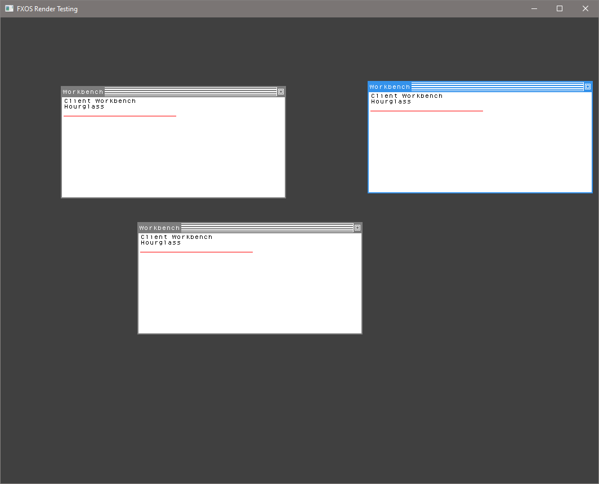

# FXOSRenderingEngineTest
Java application to prototype hit testing and overlapping methods.  Clearly, this is not indicative of the speed, but does allow different approaches to be implemented quickly.

### Key

*Green*:. Mouse Over

*Purple with White outlines:* Initial selection showing the overlapped rectangles.

*Purple:* Selected

New Windows C Version
Windows application to prototype faster hit testing and overlapping methods.  The new redraw is based on overlaps so it is much faster than that implemented in FXOS currently.
This code is generally portable to FXOS, so will be incorporated time allows.

